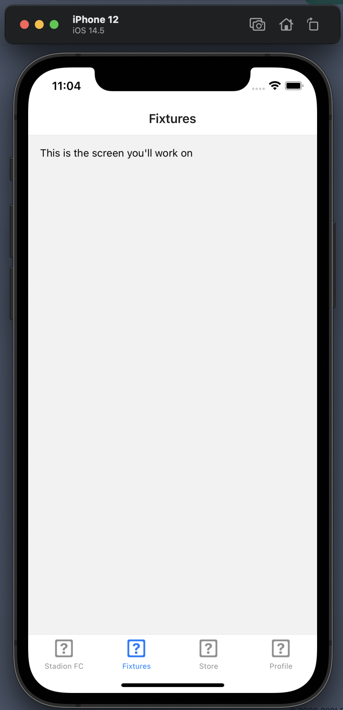

# Stadion FC React Native app

* [Stadion FC React Native app](#stadion-fc-react-native-app)
* [App architecture](#app-architecture)
   * [File Structure](#file-structure)
   * [Modules](#modules)
* [Your tasks](#your-tasks)
   * [Task List](#task-list)
   * [How to deliver your work back to us](#how-to-deliver-your-work-back-to-us)

Stadion has started its own Football club so that it can participate in some friendly matches with some well known clubs. Of course, you can't be a real football club unless you have your own native app, so we've decided to build our own.

The exercise you'll be embarking on will implement a feature of the app.

We'll explain what that is soon, but first we'll help you get your bearings by giving you a brief overview of the architecture of the application.

> **Note:**  you're about to be given a top level overview of the app structure as a whole. To give you a bit of context as to the scope of the exercise, the only files you'll be expected to work with are in the **fixtures** module. The specifics of this will follow.

# App architecture

A Stadion developer has already scaffolded the app out, and so far we have setup:

- A boiler plate React Native project using Typescript.
- [React Navigation](https://github.com/react-navigation/react-navigation) for routing
- [Redux](https://redux.js.org) for state management
  - With [Typesafe actions](https://github.com/piotrwitek/typesafe-actions) for better typing support
- [Styled Components](https://www.styled-components.com) for component building
- A small API module which uses mock data and some timeouts to simulate loading latency.

The general layout and bootstrapping of the application follows some fairly common patterns, so if you start navigating the code from `App.tsx`, you should hopefully find some familiarity with the structure.

## File Structure

The file and folder structure, whilst not so big yet, has started to layout what could be considered a good foundation for modularisation and separation of concerns.

| Path                     | Description                                                  |
| ------------------------ | ------------------------------------------------------------ |
| `./src`                  | Most of the app related source code resides in this directory. |
| `./src/modules`          | This directory is the home for all the modules in the application. Modules contain all the UI and state concerns for a given "vertical" in the app. See more in the Modules section. |
| `./src/modules/fixtures` | The **fixtures** module. Contains all code related to the fixtures section in the app. |
| `./src/modules/home`     | The **home** module. Contains all code related to the fixtures section in the app. |
| `./src/modules/profile`  | The **profile** module. Contains all code related to the fixtures section in the app. |
| `./src/modules/store`    | The **store** module. Contains all code related to the fixtures section in the app |
| `./src/core`             | Common code that the modules share.                          |
| `./src/core/api`         | The API and mock data is in this folder.                     |
| `./src/core/components`  | This folder contains components that are shared or common to all the modules in the application. Typically, this only includes very generic components that aren't related to any one specific module. |
| `./src/store`            | Scaffolding code for redux.                                  |
| `./src/types`            | Type declarations to extend Typescript.                      |

## Modules

The modules correspond one for one with the tabs in the bottom tab navigation of the app.

Each module at a minimum has:

- Some screens
- Some components
- An `actions.ts` file that contains all the actions for a module.
- A `reducer.ts` file that contains the reducer that handles the actions in the `actions.ts`
- A `thunks.ts` file that contains asynchronous behaviours, such as fetching data from servers.

The only module currently in development is the **fixtures** module, and this is the module within which you'll be working.

# Your tasks

After setting up the basic layout of the project, the Stadion developer's next priority to implement a list of upcoming fixtures (i.e upcoming games).

However, after being promoted to Center Midfield in the Stadion FC team, the developer now needs you to finish that task.

**The dev has already completed the following:**

- Created a `FixturesScreen.tsx` and plugged it into the router.
- Implemented a `useEffect` in that screen that calls a redux thunk, which in turn loads all the fixtures that Stadion are yet to play.
- Used some redux state selector hooks to pull in:
  - A boolean called `fixturesLoading`, which indicates whether the API request to fetch the fixtures is currently in progress.
  - An array of `Fixture` objects called `fixtures`, which contains all the data that the returned for the aforementioned API call.

## Task List

- [ ] Clone this repository
- [ ] Show a simple loading indicator whilst the API call is in progress.
- [ ] When the loading is finished, display a list of "cards" that show all the results that are in the  `fixtures` variable.

  - We've included a wireframe of what the card can look like below.	
- [ ] All of the data displayed in the card is driven by each individual item in the `fixtures` array.
  - [ ] We've console logged out the data in the screen so that you can see what it looks like.
- [ ] Run `yarn tsc` to check for and fix any typing issues.
- [ ] Run `yarn lint` to check for and fix any linting issues.

The approach you choose to render the list of results is up to you, though it's worth considering that at some point soon the amount of data will grow so it's worth considering rendering performance up front.

## How to deliver your work back to us

In normal circumstances, your work would submitted as a PR. However in this case, we'd like you to submit your work to us using the following steps:

- [ ] Delete the `node_modules` folder completely
- [ ] Compress the entire project folder into a zip
- [ ] Send your ZIP file through to the Stadion person who you've been in contact with.

